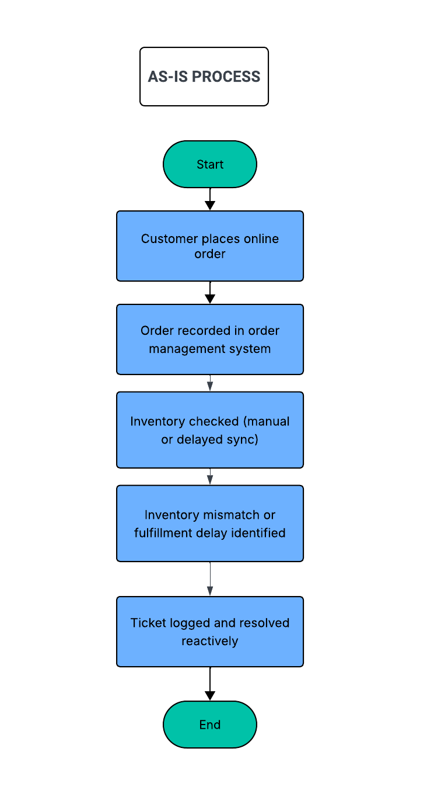

# 📦 Order Fulfillment Process Improvement  
**Business Analyst Case Study (Simulated)**

---

## Project Snapshot
**Role:** Business Analyst (case study simulation)  
**Domain:** Retail organization with online ordering  
**Problem:** Delays in order processing and frequent inventory mismatches  
**Outcome:** Identified process gaps, defined operational KPIs, and proposed practical improvements to support better fulfillment performance

---

## Overview
This is a simulated Business Analyst case study that reflects how I approach operational problems, process analysis, and KPI-driven decision support.

The scenario is based on a retail organization offering online ordering, where fulfillment delays and inventory mismatches are creating operational inefficiencies and impacting customer experience.

**Note:** This case study is fictional and was created for portfolio and learning purposes. It does not involve a real organization or proprietary data.

---

## Business Context
The organization operates both physical stores and an online ordering channel. Over time, teams began experiencing frequent fulfillment delays and situations where online orders could not be completed due to inventory mismatches.

These issues resulted in:
- Delayed or missed shipments  
- Order cancellations  
- Increased customer complaints  

While issues were being logged through a ticketing system, leadership lacked visibility into recurring patterns and trends that could support proactive improvements rather than reactive fixes.

---

## Problem Statement
Order fulfillment issues were primarily addressed after they occurred, through manual ticket resolution. There was no structured KPI tracking or trend analysis in place, which made it difficult to identify systemic issues, measure performance, or prioritize improvements effectively.

---

## Stakeholders
**Primary Stakeholders**
- Operations Manager  
- Inventory Management Team  
- Customer Support Team  

**Secondary Stakeholders**
- Warehouse Operations  
- IT / Systems Support  

---

## My Role
In this case study, I acted as the Business Analyst and focused on:
- Reviewing order fulfillment and issue-tracking data  
- Defining KPIs to measure operational performance  
- Identifying trends and root causes behind delays and inventory mismatches  
- Translating findings into clear, actionable recommendations  

---

## Process Overview (AS-IS → TO-BE)

### Current State (AS-IS)
1. A customer places an online order  
2. The order is recorded in the order management system  
3. Inventory availability is validated manually or through delayed system updates  
4. Inventory mismatches or delays are identified after order placement  
5. Issues are logged in a Jira-style ticketing system  
6. Support teams resolve issues on a case-by-case basis  
7. Management reviews issues without structured trend analysis  

### AS-IS Process Flow

**Key Challenges**
- No KPIs to track fulfillment performance  
- Inventory issues identified too late in the process  
- Inconsistent adherence to SLAs  
- Reactive issue resolution instead of prevention  

---

### Future State (TO-BE)
Based on the gaps identified, an improved process was proposed where:
- Orders trigger inventory validation before fulfillment begins  
- Only confirmed orders move forward in the process  
- Fulfillment performance is tracked using clearly defined KPIs  
- Ticket categories are standardized to enable trend analysis  
- Operations teams review recurring issues on a regular basis

### TO-BE Process Flow

**Improvements Introduced**
- Earlier identification of inventory issues  
- Better operational visibility through KPIs  
- A shift from reactive issue handling to proactive problem identification  

---

## Data Sources
- Order records (order date, fulfillment date, status)  
- Inventory availability data  
- Ticketing system data (issue category, resolution time, priority)  

---

## KPIs Defined
To support performance monitoring and decision-making, the following KPIs were defined:

| KPI | Purpose | Business Decision Enabled |
|----|--------|---------------------------|
| Order Processing Time | Measures time from order placement to shipment | Identify bottlenecks |
| % Orders Delayed Beyond SLA | Tracks overall fulfillment efficiency | Escalate high-risk periods |
| Inventory Mismatch Rate | Monitors discrepancies between stock and orders | Improve inventory controls |
| Ticket Volume by Category | Highlights recurring operational issues | Prioritize corrective actions |
| Avg. Ticket Resolution Time | Measures operational workload | Improve resource allocation |

---

## Analysis Performed
- Reviewed order and ticket data to identify recurring delay patterns  
- Categorized issues to surface common root causes  
- Analyzed KPI trends over time  
- Identified high-impact issue categories, especially during peak periods  

---

## Key Insights
- Inventory mismatches were a significant contributor to delayed orders  
- Delays increased during peak operational hours  
- Certain ticket categories consistently took longer to resolve and exceeded SLA targets  

---

## Recommendations
- Introduce pre-order inventory validation to reduce downstream issues  
- Use dashboards to monitor fulfillment KPIs on an ongoing basis  
- Standardize ticket categorization to improve trend visibility  
- Hold regular operational reviews focused on recurring issues and performance trends  

---

## Limitations & Next Steps
**Limitations**
- No access to real-time inventory data  
- Customer segmentation data was not available  

**Future Enhancements**
- Integrate real-time inventory feeds  
- Analyze regional and customer-level impact  

---

## Tools & Techniques
- Business process analysis  
- KPI definition and measurement  
- Root cause and trend analysis  
- Jira-style issue categorization  

---

## Key Skills Demonstrated
- Business analysis and problem framing  
- Stakeholder analysis  
- Operational KPI design  
- Data-driven decision support  
- Clear documentation and communication  
